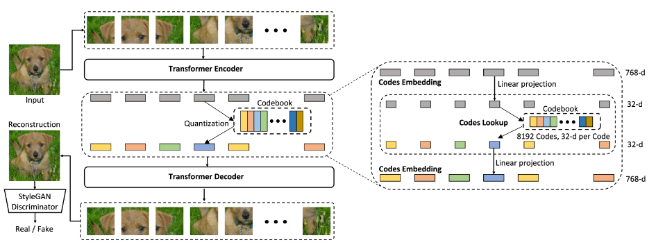

<div id="top"></div>

# VIT-VQGAN

This is an unofficial implementation of both [ViT-VQGAN](https://arxiv.org/abs/2110.04627) and [RQ-VAE](https://arxiv.org/abs/2110.04627) in Pytorch. ViT-VQGAN is a simple ViT-based Vector Quantized AutoEncoder while RQ-VAE introduces a new residual quantization scheme. Further details can be viewed in the papers



## Checkpoints
1. The release weight of ViT-VQGAN small which is trained on ImageNet at [here](https://drive.google.com/file/d/1jbjD4q0iJpXrRMVSYJRIvM_94AxA1EqJ/view?usp=sharing)
2. First release weight of ViT-VQGAN base which is trained on ImageNet at [here](https://drive.google.com/file/d/1syv0t3nAJ-bETFgFpztw9cPXghanUaM6/view?usp=sharing)
3. Add a colab notebook at [here](https://colab.research.google.com/drive/1y-PzYhkNQbhKj3i459pWd6TAO28SnF5h?usp=sharing)


## Installation

```python
pip install vitvqgan 
```


## Training

**Train the model:**
```
python -m vitvqgan.train_vim
```

You can add more options too:

```python
python -m vitvqgan.train_vim -c imagenet_vitvq_small -lr 0.00001 -e 10
```

**Inference:**
- download checkpoints from above in mbin folder
- Run the following command:
```
python -m vitvqgan.demo_recon
```


## Acknowledgements

The repo is modified from [here](https://github.com/thuanz123/enhancing-transformers) with updates to latest dependencies and to be easily run in consumer-grade GPU for learning purpose.

